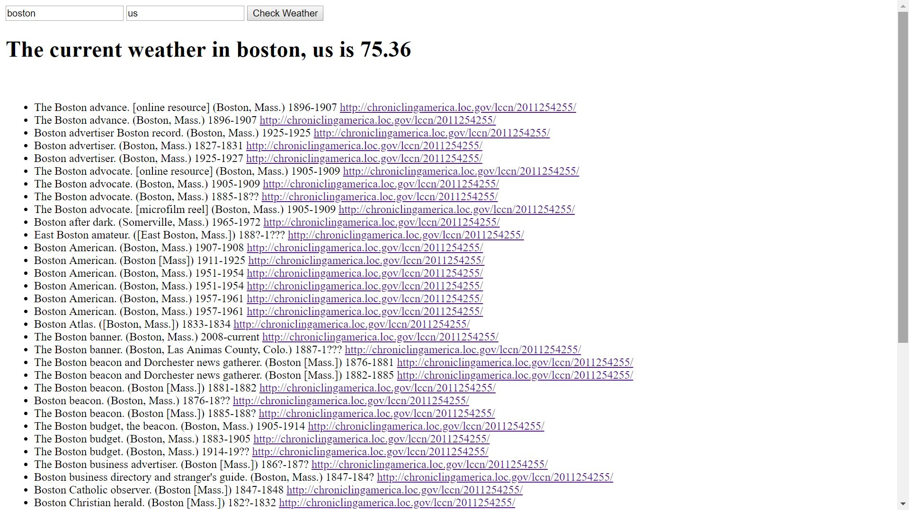

Complex Weather API
I added to my existing weather app by adding historical articles published in that city to the document incase anybody wanted more news that just the weather.

Link to project:https://rakimdevcraig.github.io/WeatherAppComplex/

How It's Made:
Tech used: HTML, CSS, JavaScript, jQuery, API's
I already had the existing weather API to work with so the user would already get the weather when they entered a city and country what I had to do was take the city that was input and display historical articles from that
city. This was done by making a seperate ajax request from my weather API and in that request I took the information from the weather API such as publisher, city and time the article was made and printed it to the DOM with the append method along with printing a link for the article. I made the weather and the newspaper information display simultaneously by tying them both to the same click event.

Lessons Learned:
I struggled at first to only get back specific information that I wanted from the API. Initially I was getting the publisher, city, year article the article was mad and the serial number but I didn't want the serial number. Using the for each method allowed me to take all of the information for each specific category I want. This allowed me to not display information I deemed not important to this project.

Examples:
Take a look at these couple examples that I have in my own portfolio:
